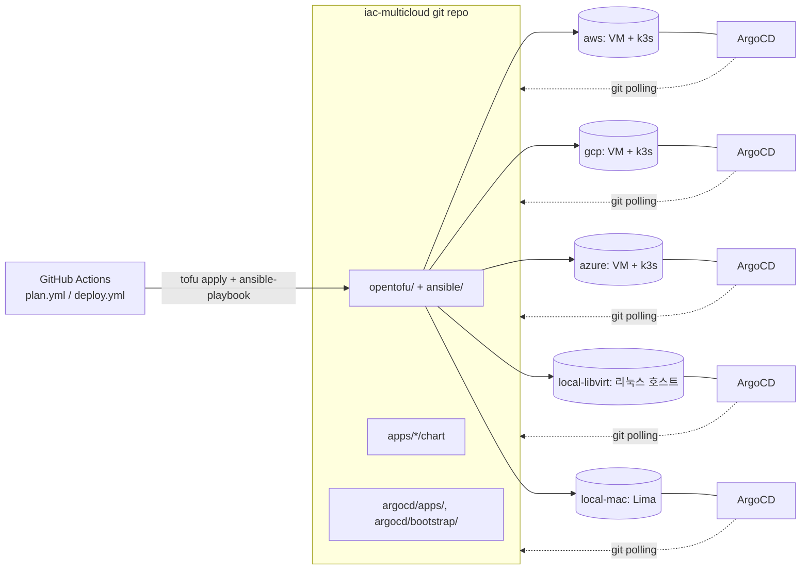

# iac-multicloud

멀티클라우드(AWS/GCP/Azure) + 로컬 인프라를 동일한 코드 구조로 프로비저닝하고,
k3s + Helm + ArgoCD(GitOps) 기반으로 애플리케이션 배포를 통일하는 IaC 저장소.

전체 계획과 단계별 진행 상황은 [CLAUDE.md](./CLAUDE.md) 참고.

## 아키텍처

- **인프라(CI/CD 대상)**: GitHub Actions가 `opentofu`로 VM/클러스터를 만들고 `ansible`로
  k3s+ArgoCD까지만 부트스트랩한다. 앱 배포는 여기서 트리거하지 않는다.
- **앱 배포(GitOps, pull 기반)**: 클러스터마다 독립적으로 설치된 ArgoCD가 이 git 저장소를
  각자 polling해서 자기 환경에 해당하는 Application만 동기화한다. 중앙에서 클러스터로 push하는
  경로가 없어서 로컬/사설망 인바운드 문제가 원천적으로 없다.



## 디렉토리 구조

| 경로 | 내용 |
|---|---|
| `opentofu/modules/` | provider별 `network`/`compute-*` 모듈. 입출력 변수명 통일(`network_id`/`subnet_id`, `instance_id`/`instance_ip`) |
| `opentofu/environments/` | `aws`, `gcp`, `azure`, `local-libvirt`(리눅스 호스트), `local-mac`(Lima) |
| `opentofu/bootstrap/` | 원격 tfstate 저장소(S3/GCS/Storage Account) 1회성 생성 |
| `ansible/roles/` | `common`(base), `k3s`(server/agent), `argocd`(Helm 설치) |
| `argocd/apps/` | 환경별 ArgoCD `Application` 매니페스트 (`{app}-{env}.yaml`) |
| `argocd/bootstrap/` | 클러스터당 1회 적용하는 app-of-apps 루트 (`root-{env}.yaml`) |
| `apps/` | 앱별 Helm chart. `sample-hello-nestjs`는 파이프라인 검증용 샘플 |
| `policy/` | OPA(Conftest) 정책 — PR 단계 `tofu plan` 검증 |
| `.github/workflows/` | 인프라 전용 CI/CD (`plan.yml`, `deploy.yml`) |

## 사전 준비물

| 도구 | 용도 |
|---|---|
| [OpenTofu](https://opentofu.org) >= 1.7 | 인프라 프로비저닝 |
| [Ansible](https://www.ansible.com) | k3s + ArgoCD 부트스트랩 |
| [Helm](https://helm.sh) | 앱 배포 검증 |
| [Conftest](https://www.conftest.dev) | OPA 정책 로컬 검증 |
| AWS/GCP/Azure 자격증명 | 해당 클라우드 환경 작업 시 |
| [libvirt](https://libvirt.org) + QEMU/KVM | `local-libvirt` (리눅스 호스트 전용) |
| [Lima](https://lima-vm.io) + [socket_vmnet](https://github.com/lima-vm/socket_vmnet) | `local-mac` (macOS/Apple Silicon 전용) |

자세한 설치·설정 절차는 [docs/onboarding.md](./docs/onboarding.md) 참고.

## 빠른 시작

아래 명령은 저장소 루트에서 시작한다고 가정한다.

```bash
# 1) 원격 state 백엔드 준비 (클라우드 환경, 1회성 - local-libvirt/local-mac은 불필요)
(cd opentofu/bootstrap/aws && tofu init && tofu apply)

# 2) 인프라 provisioning
cd opentofu/environments/<env>
cp terraform.tfvars.example terraform.tfvars   # 값 채우기
tofu init && tofu apply
cd -   # 저장소 루트로 복귀

# 3) k3s + ArgoCD 부트스트랩
cd ansible
ansible-galaxy collection install -r requirements.yml
ansible-playbook -i inventories/<env>/hosts.ini playbooks/site.yml

# 4) ArgoCD app-of-apps 최초 등록 (클러스터당 1회)
export KUBECONFIG=fetched/<node-ip>-kubeconfig.yaml
kubectl apply -f ../argocd/bootstrap/root-<env>.yaml
```

## 더 알아보기

- [docs/onboarding.md](./docs/onboarding.md) — 신규 기여자 온보딩, 환경별 사전 준비
- [docs/adding-a-node.md](./docs/adding-a-node.md) — 노드 추가/스케일, 신규 환경 추가
- [docs/adding-an-app.md](./docs/adding-an-app.md) — 신규 앱 추가 절차
