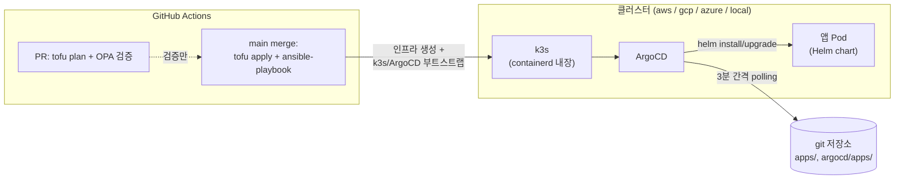
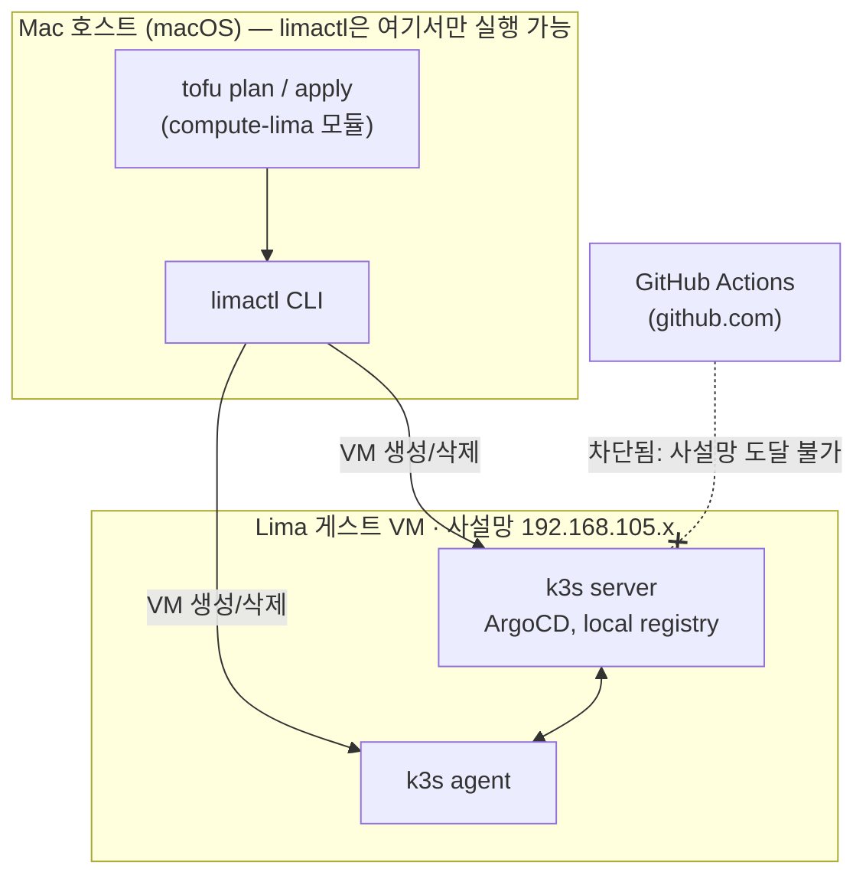
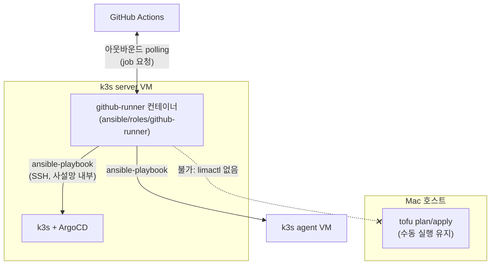
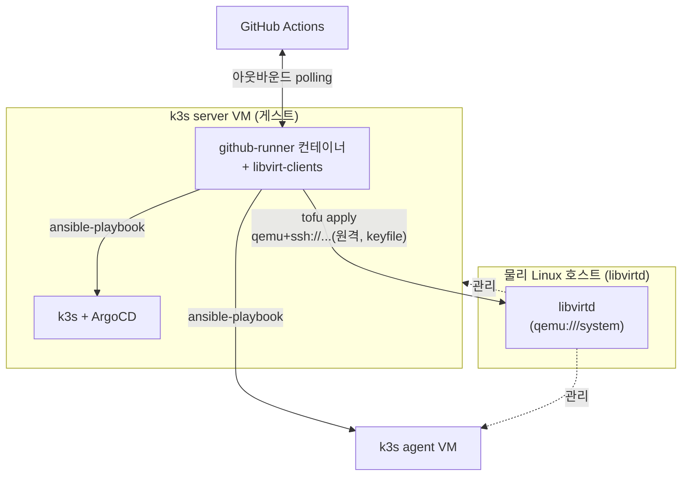

# 아키텍처 가이드

OpenTofu → Ansible → k3s → ArgoCD 로 이어지는 배포 파이프라인 전체를 그림과 용어집으로 정리한다.
local-mac 환경과 self-hosted runner(`ansible/roles/github-runner`)가 어디에 끼워지는지 위주로 본다.

## 1. 큰 그림 — pull 기반 GitOps

CI(GitHub Actions)는 **인프라**(VM/클러스터 생성, k3s+ArgoCD 부트스트랩)까지만 담당한다. 앱 배포는 각
클러스터에 독립 설치된 ArgoCD가 git 저장소를 직접 polling해서 처리한다 — CI가 클러스터로 push할 필요가
없는 구조다.

**포인트.** CI는 화살표가 클러스터로 *들어가는* 방향(push)이 아니라, ArgoCD가 git을 *당겨오는*(pull)
방향이다. 그래서 로컬/사설망 클러스터에 외부에서 접근 가능한 포트를 열어둘 필요가 없다.

> **주의.** 이 pull 방식은 **앱 배포**에만 적용된다. VM 생성이나 k3s 설치 같은 **인프라 변경**은 여전히
> CI(또는 사람)가 클러스터 쪽으로 SSH/API 호출을 해야 하는 push 방식이다 — 이게 2, 3절에서 나오는
> 문제의 출발점이다.

## 2. local-mac 상세 — 호스트/게스트 경계

local-mac은 Mac 위에 `limactl`로 Lima VM(k3s server 1대 + agent 1대)을 띄우는 환경이다. **Mac 호스트**와
**Lima 게스트 VM**은 완전히 분리된 두 개의 실행 공간이다.

**왜 중요한가.** `compute-lima` 모듈의 IP 조회(`data.external.lima_ip`)도 `limactl` 호출이라, **plan
단계조차** Mac 호스트에서만 실행된다. GitHub 호스팅 러너가 이 사설망에 절대 못 들어오는 이유가 위 그림의
마지막 화살표(✕)다.

## 3. self-hosted runner — 이번에 추가한 부분

GitHub이 못 들어오는 사설망 안에, 반대로 **바깥으로 나가는** 연결을 만드는 게 self-hosted runner다.
게스트 VM 안에 컨테이너로 러너를 띄우면, 러너가 GitHub에 job을 *요청*하러 나가기 때문에 인바운드 포트
개방이 필요 없다.

**결론 (local-mac).** 이 러너로 `ansible-playbook`(k3s/ArgoCD 재설정, role 변경 반영)은 자동화할 수
있지만, `tofu plan/apply`(VM 생성·삭제)는 여전히 Mac에서 사람이 실행해야 한다. `limactl`이 데몬/원격
프로토콜 없는 순수 로컬 CLI라서 게스트 VM 안에서 호스트를 원격으로 조작할 방법이 없기 때문이다. 그래서
아직 `deploy.yml` 매트릭스에는 편입하지 않았다.

### local-libvirt는 다르다 — tofu apply까지 컨테이너 안에서

`libvirt`는 `limactl`과 달리 daemon(libvirtd) + 원격 클라이언트 구조로 설계됐다. `libvirt_uri`를
`qemu+ssh://user@호스트IP/system`으로 주면 게스트 VM 안의 러너 컨테이너가 네트워크로 물리 호스트의
libvirtd에 접속해 다른 VM을 만들 수 있다 — 즉 **tofu apply부터 ansible-playbook까지 전부** 이 러너
하나로 처리 가능하다.

**결론 (local-libvirt).** `github_runner_extra_packages: "libvirt-clients"`
(`ansible/inventories/local-libvirt/group_vars/all.yml`)로 terraform-provider-libvirt가 필요로 하는
클라이언트 라이브러리를 러너 컨테이너에 추가 설치하고, `libvirt_uri`를 원격 URI로 override하면 이 환경은
`deploy.yml` 매트릭스에 그대로 있는 지금 구조(tofu apply + ansible-playbook 한 job)를 그대로 이 러너가
실행할 수 있다.

### 지금 상태 — 코드는 있지만 켜져 있지 않음

role(`ansible/roles/github-runner`)만 저장소에 추가된 상태다. 실제로 켜려면 세 단계가 필요하다
(local-libvirt는 실제 대상 Linux/libvirtd 호스트가 아직 없어 3번은 보류 중).

| 단계 | 실행 위치 | 명령/작업 |
|---|---|---|
| 1. PAT 발급 | GitHub 웹 | repo scope 토큰 생성 |
| 2. 러너 기동 | 대상 호스트 터미널 | `ansible-playbook ... --tags github-runner -e github_runner_repo=... -e github_runner_pat=...` |
| 3. 등록 확인 | GitHub 웹 | Settings → Actions → Runners에서 `local-mac`/`local` 라벨 확인 |

## 4. 용어집

| 용어 | 설명 | 왜 필요한가 |
|---|---|---|
| OpenTofu | Terraform 호환 오픈소스 IaC 도구. VM/클러스터 등 인프라를 코드로 선언. | provider별 입출력 변수명을 통일해 클라우드 교체를 `environments/` 레이어만으로 흡수. |
| Ansible | SSH로 접속해 서버를 설정하는 구성관리 도구. 이 저장소에서는 k3s 설치·조인, ArgoCD 설치까지만 담당. | 관리형 K8s(EKS 등)는 컨트롤 플레인을 클라우드가 관리해 이 단계가 불필요. |
| k3s | 경량 Kubernetes 배포판. containerd가 내장돼 있어 별도 Docker 설치가 필요 없음. | 단일 노드부터 시작해 노드만 추가하면 그대로 확장되는 동일 아키텍처 유지. |
| Helm | Kubernetes 앱 배포 단위(chart). `docker-compose.yml` 대신 앱마다 chart 하나. | 앱 종류(Spring/NestJS 등)에 무관하게 배포 방식을 통일. |
| ArgoCD / GitOps | 클러스터가 git 저장소를 스스로 polling해 상태를 동기화하는 pull 기반 배포 방식. | CI가 클러스터로 push할 필요가 없어 사설망 인바운드 문제가 원천 해소. |
| OPA / Conftest | tofu plan 결과(JSON)를 정책(rego)으로 검증하는 도구. PR 단계에서 실행. | 잘못된 설정이 apply되기 전에 PR에서 차단. |
| tfstate backend | OpenTofu가 리소스 상태를 저장하는 원격 저장소(S3+DynamoDB / GCS / Storage Account). | 여러 사람·CI가 동시에 apply해도 상태가 꼬이지 않게 잠금(lock) 제공. |
| Lima | macOS에서 Linux VM을 가볍게 띄우는 도구(`limactl`). 이 저장소의 local-mac 환경 기반. daemon/원격 프로토콜이 없는 순수 로컬 CLI. | Docker Desktop 없이 macOS에서 실제 Linux+k3s 환경을 재현. |
| libvirt | Linux KVM/QEMU를 다루는 가상화 관리 API. daemon(libvirtd)+원격 클라이언트 구조라 `qemu+ssh://`로 네트워크 너머에서도 VM을 관리 가능. 이 저장소의 local-libvirt 환경 기반. | Lima와 달리 원격 관리가 가능해 러너 컨테이너가 게스트 VM 안에서도 tofu apply를 대신 실행할 수 있음. |
| containerd / nerdctl | k3s에 내장된 컨테이너 런타임과 그 CLI. registry, github-runner 컨테이너도 이 소켓을 재사용. | Docker를 별도로 설치하지 않고 k3s가 이미 가진 런타임만 사용. |
| self-hosted runner | GitHub Actions job을 GitHub 서버가 아니라 사용자가 지정한 머신에서 실행시키는 에이전트. | GitHub 호스팅 러너가 도달 못 하는 사설망 안에서 job을 실행하기 위해 필요. |
| SOPS | git에 커밋해도 안전하게 시크릿을 암호화하는 도구 (로컬 환경 계획). | 클라우드는 네이티브 시크릿 매니저, 로컬은 SOPS로 역할 분담. |

## 5. 현재 상태

| 영역 | 상태 | 비고 |
|---|---|---|
| local-mac 인프라 + k3s + ArgoCD | 완료 | end-to-end 수동 검증됨 |
| github-runner role (컨테이너 설치 코드) | 코드만 | 아직 어떤 VM에서도 실행 안 함 |
| local-mac → deploy.yml 편입 | 보류 | tofu 단계는 계속 Mac에서 수동 (limactl 원격 불가) |
| local-libvirt 원격 libvirt_uri + libvirt-clients 설정 | 코드만 | `variables.tf`/`group_vars/all.yml`에 반영됨, 실제 호스트 없어 검증 전 |
| 클라우드(aws/gcp/azure) 부트스트랩 backend | 미실행 | 실비용 발생, 아직 apply 안 함 |
| local-libvirt 대상 Linux/libvirtd 호스트 | 없음 | 아직 범위 밖 — 확보되면 self-hosted runner 설치·검증 진행 |
